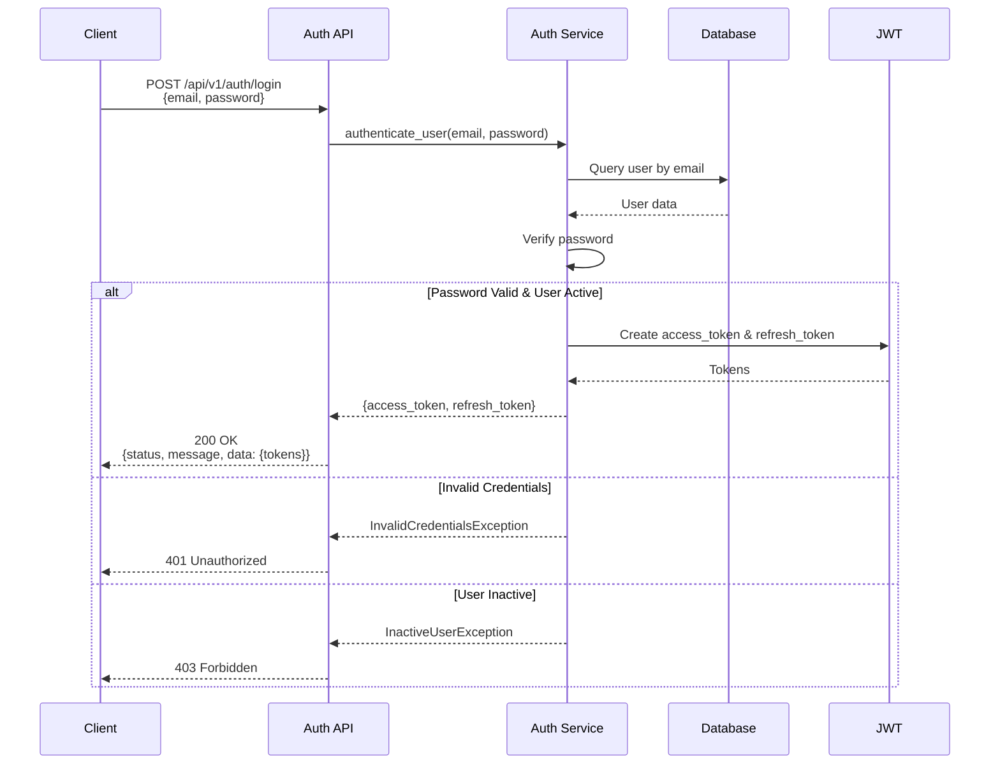
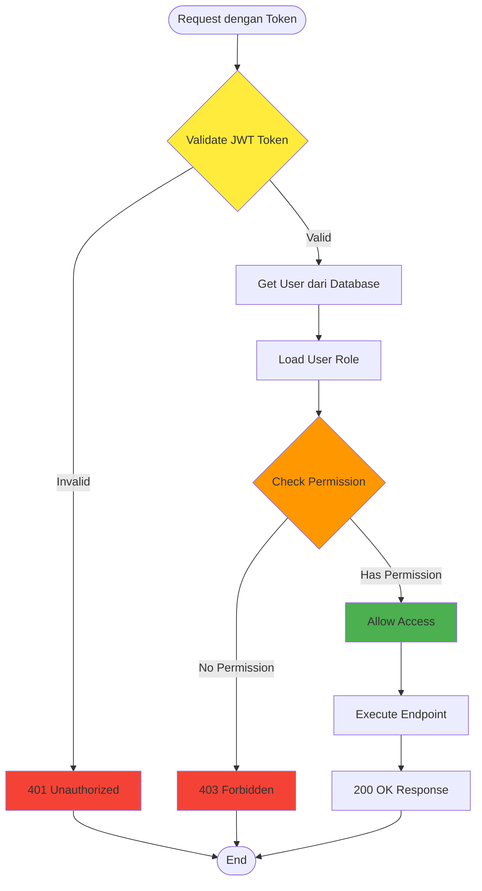
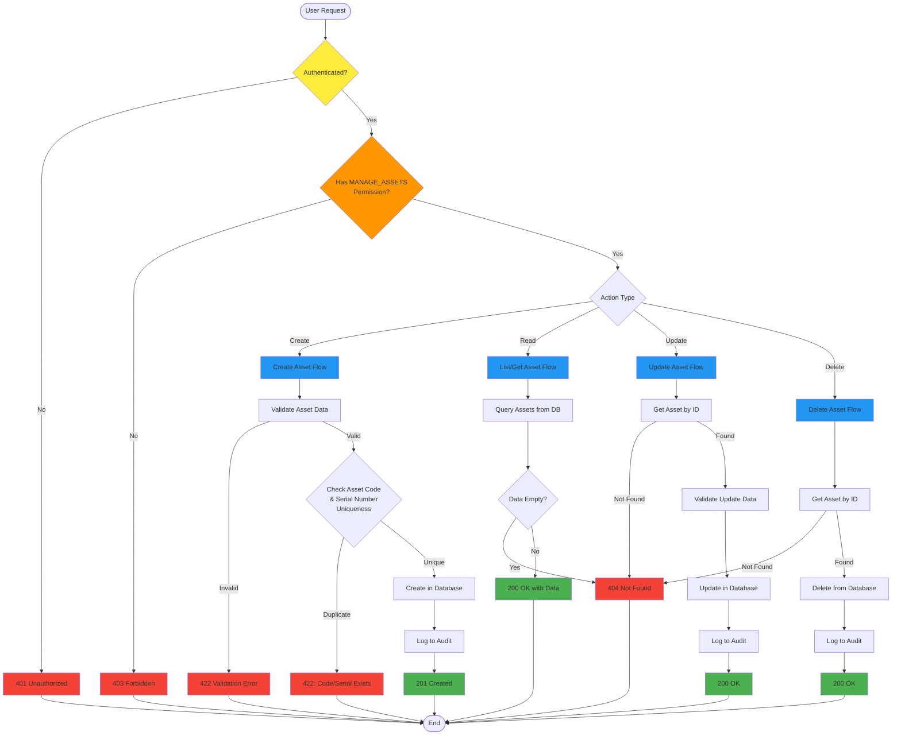
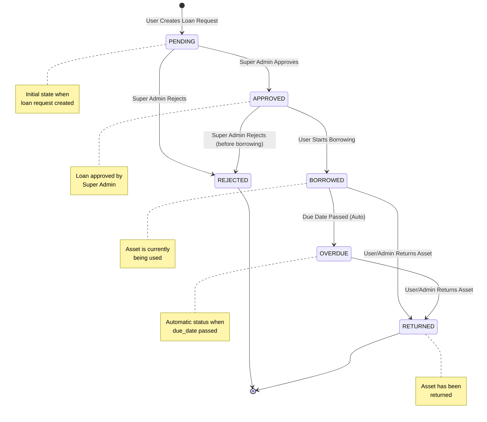
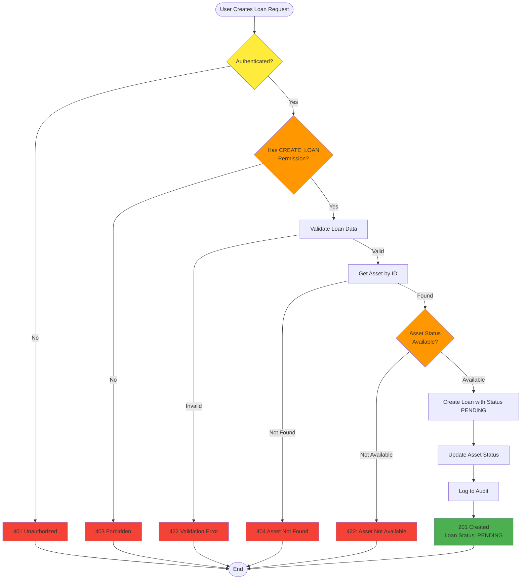
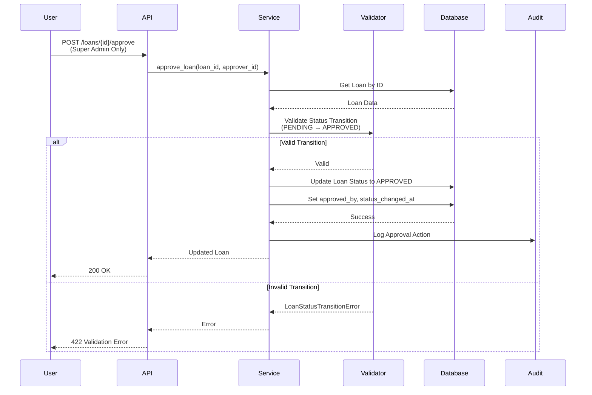
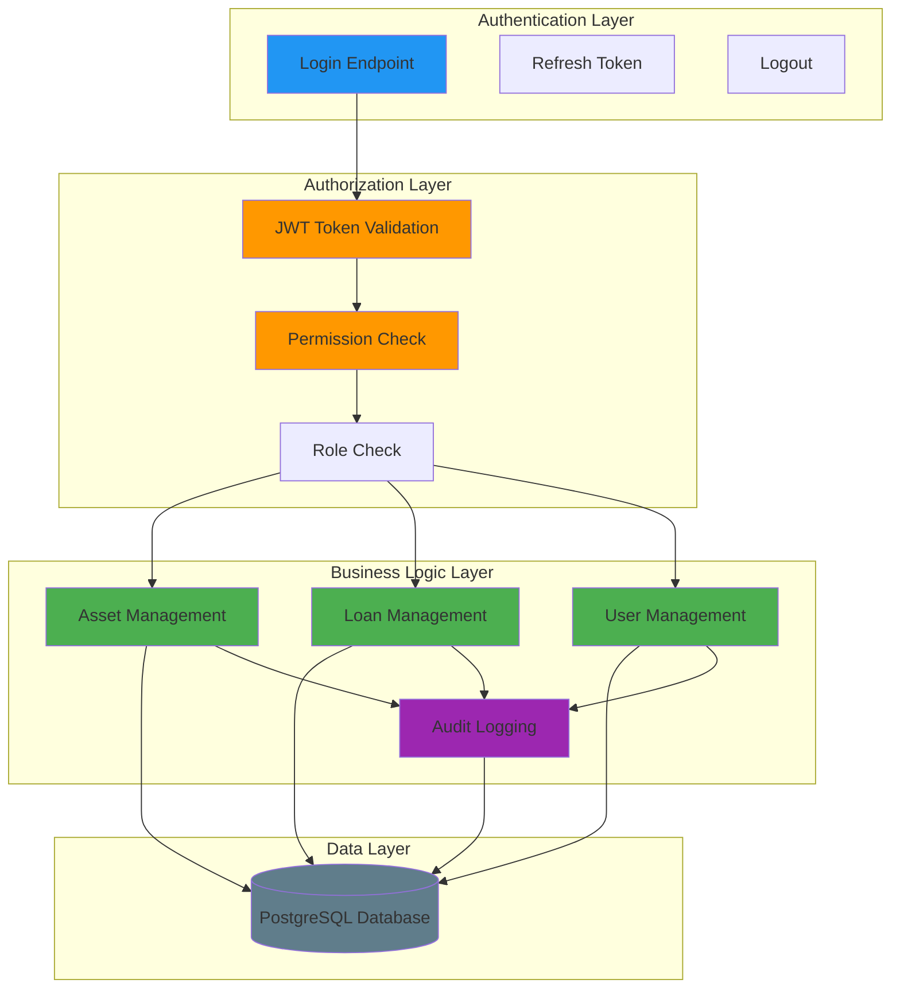
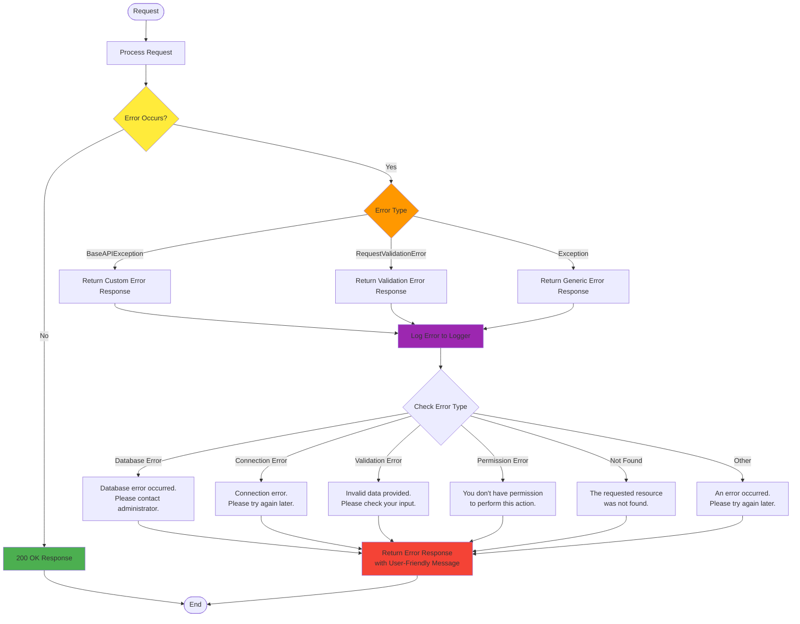

# Flow Diagram Aplikasi Cyber Asset Management

## 1. Authentication Flow



## 2. Authorization Flow (RBAC)



## 3. Asset Management Flow



## 4. Loan Management Flow (Status Transition)



## 5. Loan Request Flow (Detailed)



## 6. Loan Approval/Rejection Flow



## 7. User Management Flow

```mermaid
flowchart TD
    Start([Request]) --> CheckAuth{Authenticated?}
    CheckAuth -->|No| AuthError[401 Unauthorized]
    CheckAuth -->|Yes| CheckSuperAdmin{Is Super Admin?}
    
    CheckSuperAdmin -->|No| PermissionError[403 Forbidden]
    CheckSuperAdmin -->|Yes| Action{Action Type}
    
    Action -->|Create User| CreateUser[Create User Flow]
    Action -->|List Users| ListUsers[List Users Flow]
    Action -->|Get User| GetUser[Get User by ID Flow]
    Action -->|Update User| UpdateUser[Update User Flow]
    Action -->|Delete User| DeleteUser[Delete User Flow]
    Action -->|Activate/Deactivate| ActivateUser[Activate/Deactivate Flow]
    
    CreateUser --> ValidateUserData[Validate User Data]
    ValidateUserData -->|Invalid| ValidationError[422 Validation Error]
    ValidateUserData -->|Valid| CheckUnique{Check Username<br/>& Email Uniqueness}
    CheckUnique -->|Duplicate| DuplicateError[422: Username/Email Exists]
    CheckUnique -->|Unique| HashPassword[Hash Password]
    HashPassword --> CreateInDB[Create User in Database]
    CreateInDB --> AuditLog1[Log to Audit]
    AuditLog1 --> Success1[201 Created]
    
    ListUsers --> QueryUsers[Query Users with Filters]
    QueryUsers --> CheckEmpty{Data Empty?}
    CheckEmpty -->|Yes| NotFound[404 Not Found]
    CheckEmpty -->|No| Success2[200 OK with Data]
    
    GetUser --> GetUserByID[Get User by ID]
    GetUserByID -->|Not Found| NotFound
    GetUserByID -->|Found| CheckOwner{Is Owner or<br/>Super Admin?}
    CheckOwner -->|No| PermissionError
    CheckOwner -->|Yes| Success3[200 OK]
    
    UpdateUser --> GetUserByID2[Get User by ID]
    GetUserByID2 -->|Not Found| NotFound
    GetUserByID2 -->|Found| CheckUpdatePermission{Can Update?<br/>(Owner or Admin)}
    CheckUpdatePermission -->|No| PermissionError
    CheckUpdatePermission -->|Yes| ValidateUpdate[Validate Update Data]
    ValidateUpdate --> UpdateInDB[Update User in Database]
    UpdateInDB --> AuditLog2[Log to Audit]
    AuditLog2 --> Success4[200 OK]
    
    DeleteUser --> GetUserByID3[Get User by ID]
    GetUserByID3 -->|Not Found| NotFound
    GetUserByID3 -->|Found| DeleteFromDB[Delete User from Database]
    DeleteFromDB --> AuditLog3[Log to Audit]
    AuditLog3 --> Success5[200 OK]
    
    ActivateUser --> GetUserByID4[Get User by ID]
    GetUserByID4 -->|Not Found| NotFound
    GetUserByID4 -->|Found| ToggleStatus[Toggle is_active Status]
    ToggleStatus --> AuditLog4[Log to Audit]
    AuditLog4 --> Success6[200 OK]
    
    AuthError --> End([End])
    PermissionError --> End
    ValidationError --> End
    DuplicateError --> End
    NotFound --> End
    Success1 --> End
    Success2 --> End
    Success3 --> End
    Success4 --> End
    Success5 --> End
    Success6 --> End
    
    style CheckAuth fill:#ffeb3b
    style CheckSuperAdmin fill:#ff9800
    style CheckOwner fill:#ff9800
    style CheckUpdatePermission fill:#ff9800
    style Success1 fill:#4caf50
    style Success2 fill:#4caf50
    style Success3 fill:#4caf50
    style Success4 fill:#4caf50
    style Success5 fill:#4caf50
    style Success6 fill:#4caf50
    style AuthError fill:#f44336
    style PermissionError fill:#f44336
    style ValidationError fill:#f44336
    style DuplicateError fill:#f44336
    style NotFound fill:#f44336
```

## 8. Complete Application Flow Overview



## 9. Error Handling Flow



## 10. Permission Matrix

```mermaid
graph LR
    subgraph "Super Admin Permissions"
        SA1[MANAGE_USERS]
        SA2[VIEW_USERS]
        SA3[MANAGE_ROLES]
        SA4[VIEW_ROLES]
        SA5[MANAGE_ASSETS]
        SA6[VIEW_ASSETS]
        SA7[MANAGE_CATEGORIES]
        SA8[VIEW_CATEGORIES]
        SA9[MANAGE_LOANS]
        SA10[VIEW_OWN_LOANS]
        SA11[CREATE_LOAN]
        SA12[RETURN_LOAN]
        SA13[VIEW_AUDIT_LOGS]
    end
    
    subgraph "User Permissions"
        U1[VIEW_ASSETS]
        U2[VIEW_CATEGORIES]
        U3[VIEW_OWN_LOANS]
        U4[CREATE_LOAN]
        U5[RETURN_LOAN]
    end
    
    style SA1 fill:#4caf50
    style SA2 fill:#4caf50
    style SA3 fill:#4caf50
    style SA4 fill:#4caf50
    style SA5 fill:#4caf50
    style SA6 fill:#4caf50
    style SA7 fill:#4caf50
    style SA8 fill:#4caf50
    style SA9 fill:#4caf50
    style SA10 fill:#4caf50
    style SA11 fill:#4caf50
    style SA12 fill:#4caf50
    style SA13 fill:#4caf50
    
    style U1 fill:#2196f3
    style U2 fill:#2196f3
    style U3 fill:#2196f3
    style U4 fill:#2196f3
    style U5 fill:#2196f3
```



## Catatan

1. **Authentication**: Semua request memerlukan JWT token (kecuali login)
2. **Authorization**: Setiap endpoint memeriksa permission sesuai role
3. **Audit Logging**: Semua operasi penting dicatat di audit log
4. **Error Handling**: Semua error ditampilkan dengan pesan user-friendly
5. **Status Transition**: Loan status mengikuti state machine yang valid
6. **Data Validation**: Semua input data divalidasi sebelum diproses

## Tools untuk View Diagram

Diagram di atas menggunakan format Mermaid yang dapat dirender di:
- GitHub/GitLab (otomatis)
- VS Code dengan extension Mermaid Preview
- Online: https://mermaid.live/
- Dokumentasi: https://mermaid.js.org/

